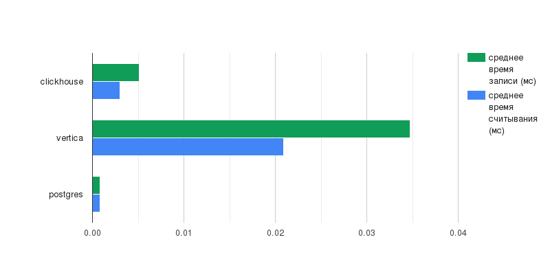
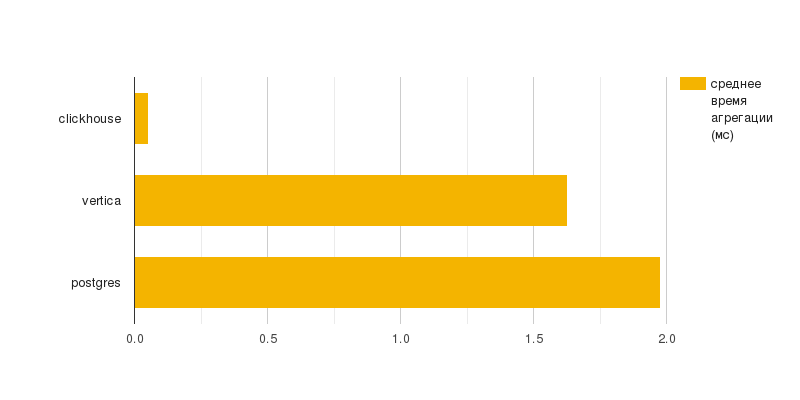

# Сравнение производительности хранилищ

Запуск:
 - `python generate_data.py`
 - `docker compose up`
 - `python storage_test.py`

### Таблица с результатами исследования хранилищ данных

|    name    |  read  | write  |  agg   |
|:----------:|:------:|:------:|:------:|
| clickhouse | 0.0051 | 0.003  | 0.0532 |
|  vertica   | 0.0347 | 0.0209 | 1.6296 |
|  postgres  | 0.0008 | 0.0008 | 1.977  |

### График с результатами исследования операций записи/считывания в хранилища

### График с результатами исследования операции агрегации в хранилищах

